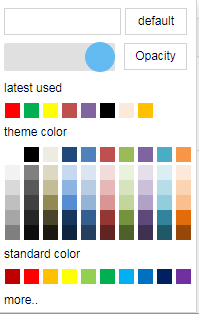

# color-picker

## 项目主页
点击[这里](https://zhangbobell.github.io/color-picker)查看 demo

## UI


## 特点
1. 简单易用，UI 和 Microsoft Word 2013 的拾色器一样；
2. 增加了「最近使用」的功能；
3. 在支持 html5 input[type='color'] 的浏览器实现了「更多颜色」的功能

## 获取
你可以直接下载 dist 目录里的 css 和 js 使用，比较快捷的方式是直接安装 bower 包：先安装 [bower](http://bower.io/)，然后运行 `bower install color-picker`；

## 用法
color-picker 基于 angular，

用法示例：
```javascript
<link rel="stylesheet" href="path/to/color-picker.min.css">

<script src="path/to/angular.js"></script>
<script src="path/to/color-picker.min.js"></script>

<!-- directive 的方式 -->
<font-color></font-color>

<!-- controller 的方式 -->
<div ng-controller="demoCtrl" color-picker default-color="#ff0000" class="font-color" ng-style="{'background-color': selectedForeColor}"></div>

<script>
    var myApp = angular.module('colorpickerDemo', ['ui.colorpicker']);

    // controller 的方式
    myApp.controller('demoCtrl', function($scope) {
        $scope.selectedForeColor = '#d3d3d3';

        $scope.$on('colorPicked', function(event, color) {
            $scope.selectedForeColor = color;
        });
    });

    // directive 的方式
    myApp.directive('fontColor', function() {
        return {
            restrict: 'E',
            scope:{},
            replace: true,
            template: '<div color-picker default-color="#ff0000" class="font-color" ng-style="{\'background-color\': selectedFontColor}"></div>',
            link: function(scope) {
                scope.selectedFontColor = '#f00';

                scope.$on('colorPicked', function(event, color) {
                    scope.selectedFontColor = color;
                });
            }
        }
    });
</script>
```

## 事件
`colorPicked` -- 在用户选择了颜色的时候触发，在 color-picker 的父 scope 里面都可以监听到，带有一个参数 `color` （用户选择的颜色值）